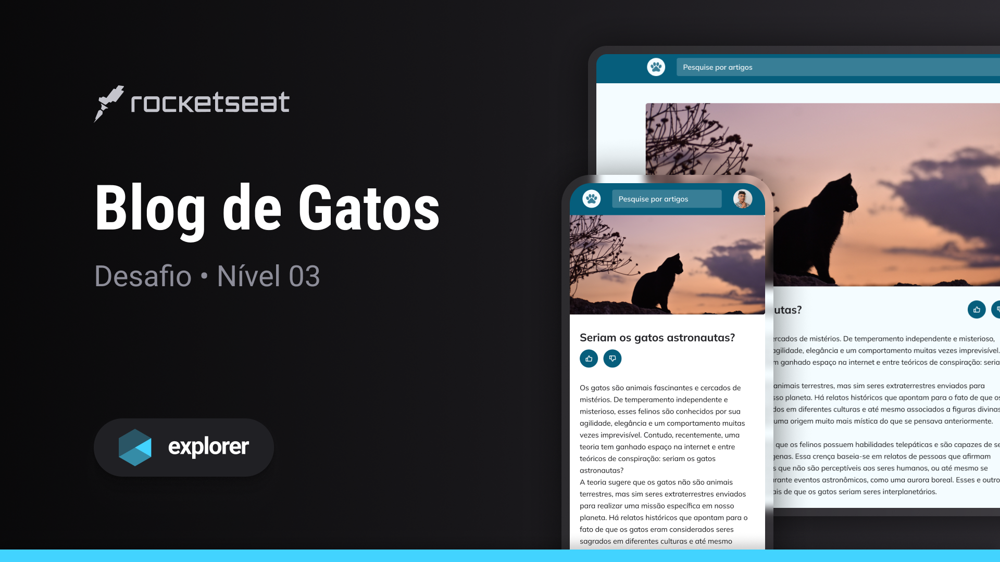

<h1 align="center">Exeplorer Stage Three From</h1>

    
    

 

    

 
 

## 🚀 Technologies Used

* HTML
* CSS
* Figma

## 💻 About this project
Explorer stage three challenge creating the blog
 
## Deploy
GitubPage: <a target="_blank" href="https://micaelapinheirods.github.io/explorer-stage-three-blog/">Deploy Application</a>
 
## 😋 Disclaim
sorry my English, I trying
 
 

👤 **Micaela Pinheiro**
---

- Twitter: [@micaelapinheir7](https://twitter.com/micaelapinheir7)
- Github: [@MicaelaPinheiroDS](https://github.com/MicaelaPinheiroDS)
- LinkedIn: [@micaela-pinheiro](https://linkedin.com/in/micaela-pinheiro)

 

## 📝 License
This project is MIT licensed.

